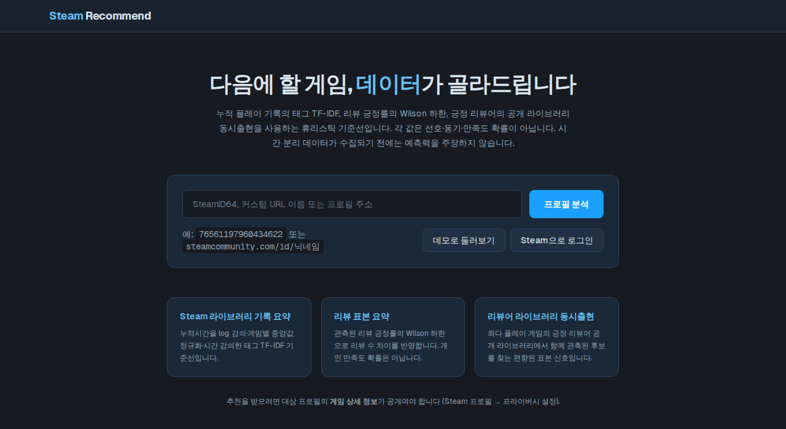
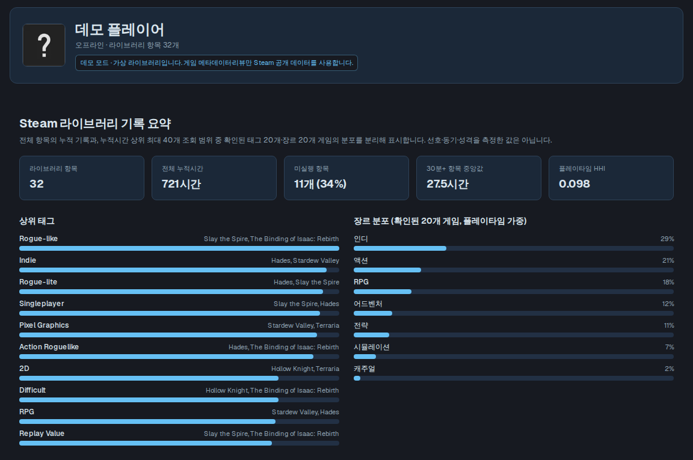
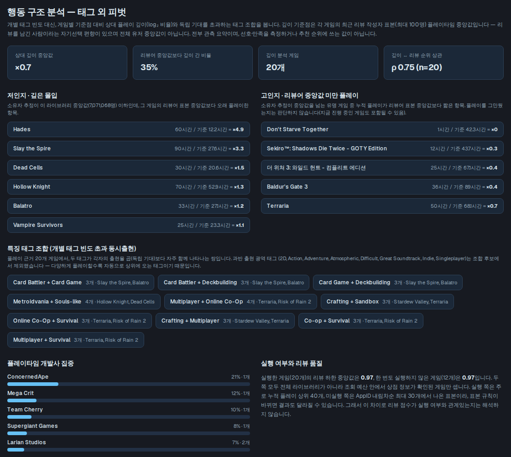
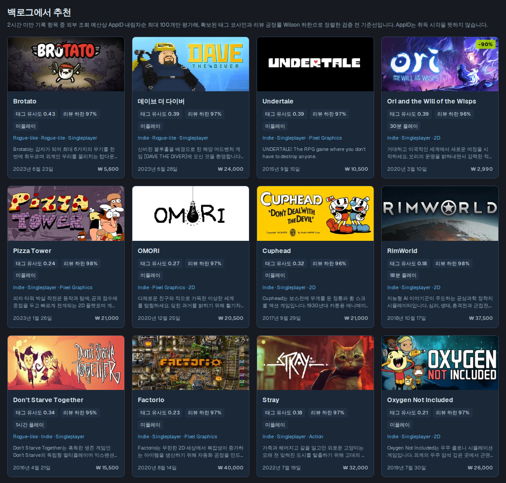
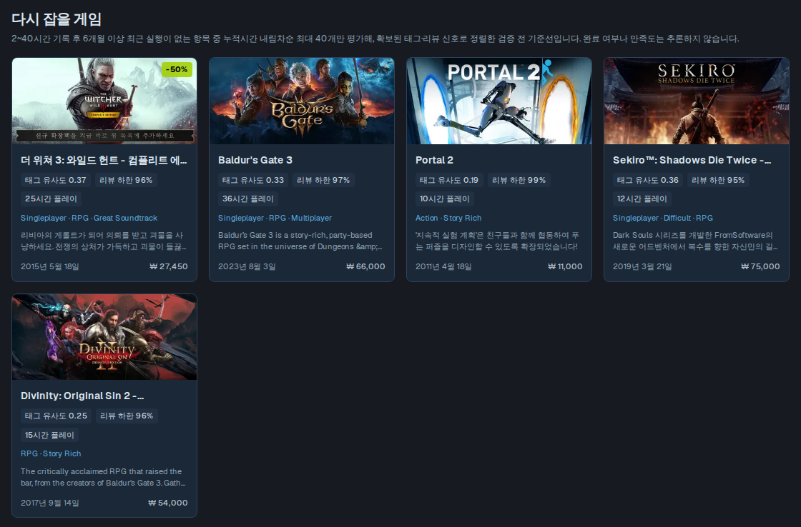
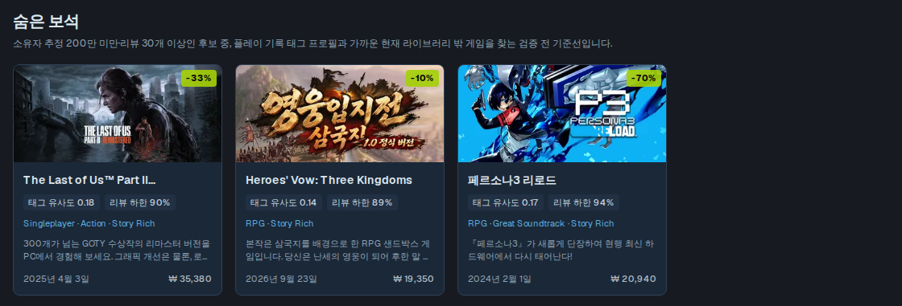
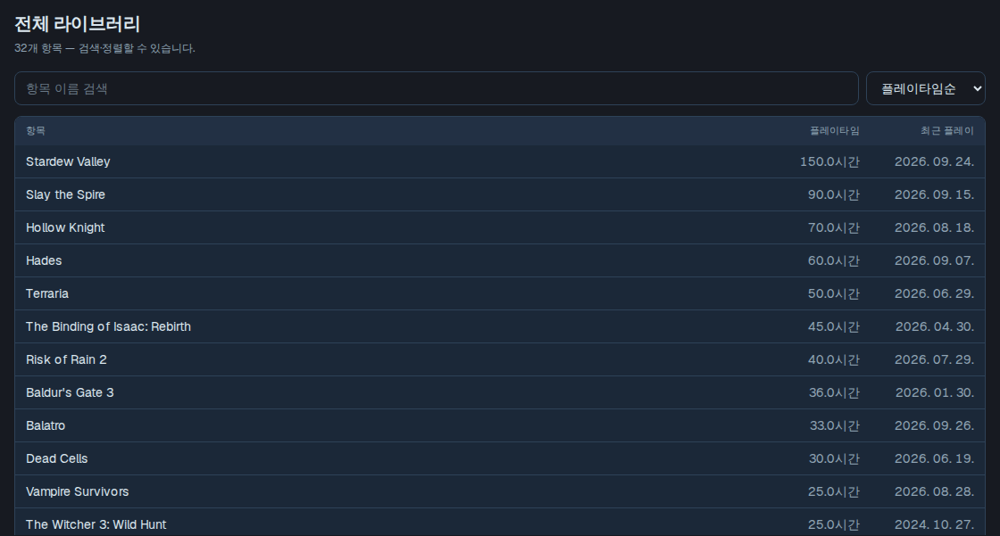
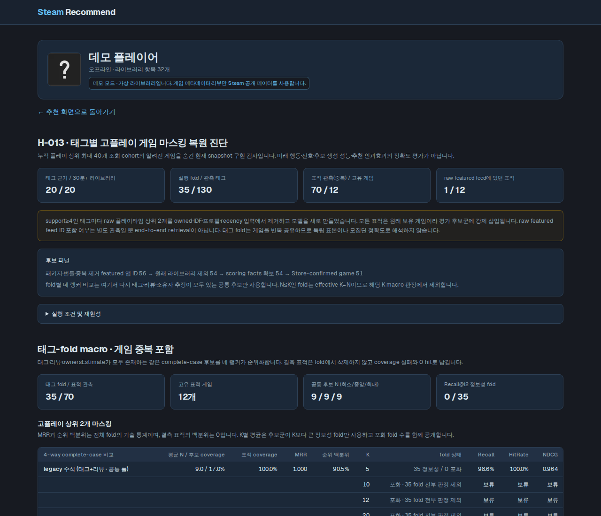

# Steam Recommend

Steam 라이브러리의 플레이 기록을 읽어 다음에 할 게임을 골라 주는 웹 앱입니다.



## 사용 방법

1. 첫 화면 입력창에 다음 중 하나를 넣고 **프로필 분석**을 누릅니다.
   - SteamID64 (예: `76561197960434622`)
   - 커스텀 URL 이름 (예: `gabelogannewell`)
   - 프로필 주소 (예: `https://steamcommunity.com/id/닉네임`)
2. 또는 **Steam으로 로그인**을 누르면 로그인한 계정의 화면으로 바로 이동합니다.
3. **데모로 둘러보기**를 누르면 가상 라이브러리로 모든 화면을 미리 볼 수 있습니다. API 키가 없어도 됩니다.

> 분석하려는 프로필은 Steam **프로필 편집 → 프라이버시 설정 → 게임 상세 정보**가 "공개"여야 합니다.
>
> 첫 분석은 외부 API 요청 간격을 지키느라 몇 분 걸릴 수 있습니다(게임 30개 내외의 데모 기준 약 3분). 게임별 공개 정보는 서버에 캐시되므로 두 번째부터는 빨라집니다.

## 기능

### 라이브러리 요약

보유 항목 수, 전체 플레이 시간, 한 번도 실행하지 않은 게임 비율, 많이 플레이한 게임의 태그와 장르 분포를 보여 줍니다. 태그 옆에는 그 태그를 대표하는 게임이 함께 표시됩니다.



### 플레이 성향 분석

- **깊은 몰입 / 리뷰어 중앙값 미만 플레이**: 각 게임의 누적 플레이 시간을 그 게임 리뷰어들의 중앙값과 비교해, 유독 오래 한 게임과 짧게 한 게임을 나눠 보여 줍니다. 짧게 한 게임은 아직 진행 중일 수도 있습니다.
- **특징 태그 조합**: "덱빌딩 + 카드 게임"처럼 자주 함께 등장하는 태그 쌍을 찾습니다.
- **개발사 집중도**: 플레이 시간이 어느 개발사에 몰려 있는지 보여 줍니다.



### 백로그에서 추천

사 두고 거의 하지 않은 게임(2시간 미만) 중에서 지금까지의 취향과 가깝고 평가가 좋은 게임을 골라 줍니다. 카드마다 태그 유사도, 리뷰 긍정률, 가격, 출시일이 나옵니다.



### 다시 잡을 게임

2~40시간 정도 하다가 6개월 넘게 손대지 않은 게임을 모아 보여 줍니다.



### 새 게임 찾기

- **플레이 기록과 가까운 신작**: Steam 신작·출시 예정 목록에서 취향과 가까운 게임을 고릅니다.
- **숨은 보석**: 아직 많이 알려지지 않았지만 평가가 좋고 취향과 가까운 게임을 고릅니다.
- **리뷰어 라이브러리 동시출현**: 플레이 기록 가중치(누적 시간, 게임별 평균 대비 비율, 최근성을 함께 반영)가 가장 높은 게임 3개를 좋게 평가한 사람들이 함께 가지고 있는 게임을 찾습니다. 서버에 `STEAM_API_KEY`가 있어야 동작합니다.



### 전체 라이브러리

모든 보유 항목을 이름으로 검색하고 플레이 시간, 최근 플레이, 이름 순으로 정렬할 수 있습니다.



### 태그 마스킹 진단 (실험 기능)

많이 플레이한 게임 일부를 숨긴 뒤 추천 방식이 그 게임을 다시 찾아내는지 확인하는 개발용 화면입니다. 추천 화면의 **태그 마스킹 복원 세션 열기**로 들어갑니다.



## 설치와 실행

Node.js 22.13 이상이 필요합니다.

```bash
npm install
cp .env.example .env.local
npm run dev
```

브라우저에서 http://localhost:3000 을 엽니다.

### 환경 변수 (`.env.local`)

| 이름 | 설명 | 필수 |
| --- | --- | --- |
| `STEAM_API_KEY` | https://steamcommunity.com/dev/apikey 에서 발급. 실제 프로필의 라이브러리를 읽을 때 필요 | 실제 프로필 분석 시 |
| `SESSION_SECRET` | 로그인 쿠키 서명용 임의 문자열 (16자 이상) | 로그인 사용 시 |
| `APP_BASE_URL` | Steam 로그인 후 돌아올 주소 (예: `http://localhost:3000`). 비우면 요청 주소를 사용 | 선택 |

API 키가 없으면 데모 모드와 프로필 헤더 조회만 동작합니다.

### 명령어

| 명령 | 설명 |
| --- | --- |
| `npm run dev` | 개발 서버 |
| `npm run build` / `npm start` | 프로덕션 빌드와 실행 |
| `npm test` | 단위 테스트 |
| `npm run lint` | 린트 |

## 알아 둘 점

- 추천 점수는 플레이 기록과 공개 리뷰로 계산한 참고값입니다. 실제로 재미있을지를 보장하지 않습니다.
- 게임 태그와 보유자 수 추정은 제3자 서비스인 SteamSpy 데이터입니다.
- 기본 설정에서는 개인 라이브러리 데이터를 서버에 저장하거나 캐시하지 않고, 게임별 공개 정보만 캐시합니다.
- 예외: 운영자가 `INSTRUMENTATION_ENABLED=1`을 켜고 로그인한 본인이 대시보드에서 수집에 동의하면, 라이브러리 스냅샷(appid·플레이 시간·마지막 실행 시각)과 추천 목록·노출 기록이 가명 처리되어 서버의 `.instrumentation/`(또는 `INSTRUMENTATION_DIR`)에 JSONL로 쌓입니다. 동의를 철회하면 이후 수집이 멈추며, 이미 쌓인 파일의 보존·삭제는 운영자가 관리합니다.
- Valve와 관계없는 개인 프로젝트입니다.

## 개발 문서

알고리즘 설계와 검증 기록은 [`docs/`](docs/) 폴더에 있습니다.

- [DESIGN.md](docs/DESIGN.md): 전체 구조
- [VALIDATION.md](docs/VALIDATION.md): 추천 신호의 검증 계획
- [ALGORITHM_AUDIT.md](docs/ALGORITHM_AUDIT.md), [ANALYSIS_QUALITY.md](docs/ANALYSIS_QUALITY.md): 분석 기록
